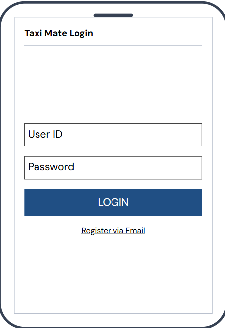
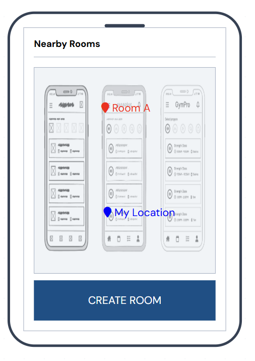
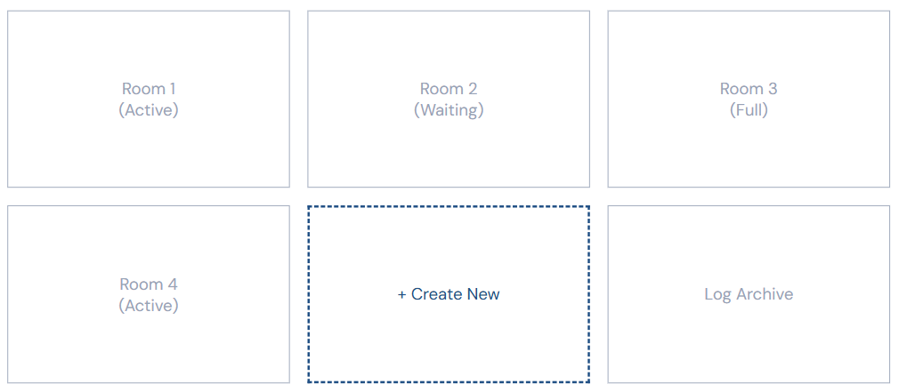
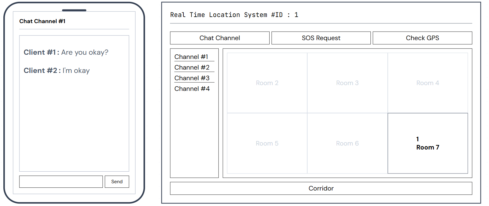

# 2. Analysis

**Project Title**: Taxi Mate  
**Student Info**: 22112052, 문진곤, moonjg0305@yu.ac.kr  
**Repository**: [https://github.com/nogniz/TaxiMate/tree/master](https://github.com/nogniz/TaxiMate/tree/master)

## [ Revision history ]

| Revision date | Version # | Description | Author |
| :--- | :--- | :--- | :--- |
| 03/27/2026 | 0.1 | 초기 컨셉 잡기 | 문진곤 |
| 04/15/2026 | 0.5 | Use Case 및 Domain Analysis 초안 완료 | 문진곤 |
| 06/11/2026 | 2.0 | 실제 구현 기반 전면 업데이트 (탑승완료/출발/강퇴, 순차하차 정산, 자동 매칭, DM, SETTLED 반영) | 문진곤 |
| 06/13/2026 | 2.1 | 이메일 인증 Brevo API 교체, Map API·PG 외부 연동 제거, 내부 Haversine 매칭 및 내부 정산 반영 | 문진곤 |

---

## = Contents =
1. [Introduction](#1-introduction)
2. [Use case analysis](#2-use-case-analysis)
3. [Domain analysis](#3-domain-analysis)
4. [User Interface prototype](#4-user-interface-prototype)
5. [Glossary](#5-glossary)
6. [References](#6-references)

---

## 1. Introduction

### 1.1 Summary
현대 사회의 대학생들에게 이동 수단은 단순한 이동을 넘어 시간과 비용의 효율성을 결정짓는 중요한 요소이다. 최근 다양한 모빌리티 서비스가 등장했으나, 대학생들이 매일 부담하기에는 택시 비용이 너무 높고, 기존의 카풀 방식은 신원 확인의 불확실성과 실시간 매칭의 어려움으로 인해 직관적인 편리함을 제공하지 못하고 있다. 이에 대학생들이 겪는 경제적 부담을 덜어주고, 안전하면서도 직관적인 동승 환경을 제공하기 위해 기획된 플랫폼이 바로 "Taxi Mate"이다.

### 1.2 Introduce "Taxi Mate"
이번에 제작하게 된 "Taxi Mate"는 실시간 위치 기반의 대학생 전용 택시 동승 매칭 서비스이다. 본 서비스는 단순한 게시판 형태의 동승자 모집 방식을 탈피하여, 사용자의 목적지와 경로를 분석해 최적의 파트너를 추천하는 자동 매칭 시스템을 제공한다. 외부 Map API 없이 서버 내부에 Haversine 공식과 26개 사전 정의 장소(DAEGU_COORDS)를 탑재하여 좌표 기반 거리 계산을 수행하며, 학교 이메일 인증(Brevo API)으로 '누가 탈지 모른다'는 불안감을 해소한다. 탑승 완료 후에는 외부 PG 연동 없이 순차하차(Sequential Drop-off) 알고리즘으로 정산을 처리한다.

### 1.3 Goal
이번 Analysis 보고서에서는 시스템의 요구사항을 구체화하기 위한 Use case analysis와 시스템의 핵심 구조를 정의하는 Domain analysis를 진행한다. 또한, 실제 사용자가 접하게 될 User Interface prototype이 어떻게 구성되었는가를 상세히 소개한다.

---

## 2. Use case analysis

### 2.1 use case description
#### Ride Sharing System - Use Case Specifications

---

### Use Case #1 : Login

#### GENERAL CHARACTERISTICS

| Item                   | Description                      |
| ---------------------- | -------------------------------- |
| Summary                | 클라이언트가 시스템에 로그인할 때 사용한다.         |
| Scope / Level          | Ride Sharing System / User level |
| Author                 | 문진곤                              |
| Last Update            | 06/13/2026                       |
| Status                 | Implemented                      |
| Primary Actor          | Client                           |
| Preconditions          | 클라이언트는 회원가입이 완료된 상태여야 한다.        |
| Trigger                | 클라이언트가 로그인 버튼을 선택한다.             |
| Success Post Condition | 24시간 유효한 JWT Bearer 토큰이 발급된다.    |
| Failed Post Condition  | 로그인에 실패하고 오류 메시지를 반환한다.          |

#### MAIN SUCCESS SCENARIO

| Step | Action                              |
| ---- | ----------------------------------- |
| S    | 클라이언트가 이메일/비밀번호를 입력한다.             |
| 1    | 시스템이 `POST /api/users/login`을 수신한다. |
| 2    | 시스템이 BCrypt로 비밀번호 일치 여부를 검증한다.      |
| 3    | 시스템이 24시간 유효 JWT를 발급하고 반환한다.        |
| 4    | 클라이언트가 JWT를 저장하고 메인 화면으로 이동한다.      |

#### EXTENSION SCENARIOS

| Step | Branching Action                   |
| ---- | ---------------------------------- |
| 2    | 2a. 비밀번호가 일치하지 않는 경우               |
|      | 2a.1. 시스템은 로그인 실패(401) 메시지를 출력한다.  |
| 2    | 2b. 존재하지 않는 계정인 경우                 |
|      | 2b.1. 시스템이 계정 없음 메시지를 반환하고 회원가입 유도 |

#### RELATED INFORMATION

| Item        | Description        |
| ----------- | ------------------ |
| Performance | <= 2 sec           |
| Frequency   | High               |
| Concurrency | Multi User         |
| Other       | JWT 기반 Stateless 인증 |

---

### Use Case #2 : Register

#### GENERAL CHARACTERISTICS

| Item                   | Description                      |
| ---------------------- | -------------------------------- |
| Summary                | 신규 사용자가 이메일 인증을 완료한 후 회원가입을 진행한다. |
| Scope / Level          | Ride Sharing System / User level |
| Author                 | 문진곤                              |
| Last Update            | 06/13/2026                       |
| Status                 | Implemented                      |
| Primary Actor          | Client                           |
| Preconditions          | 사용자는 등록되지 않은 상태여야 하며, `@yu.ac.kr` 이메일을 보유해야 한다. |
| Trigger                | 회원가입 버튼을 선택한다.                   |
| Success Post Condition | 새로운 계정이 생성된다.                    |
| Failed Post Condition  | 회원가입에 실패한다.                      |

#### MAIN SUCCESS SCENARIO

| Step | Action                                                   |
| ---- | -------------------------------------------------------- |
| S    | 클라이언트가 `@yu.ac.kr` 이메일을 입력하고 인증 요청 버튼을 누른다.           |
| 1    | 시스템이 Brevo API로 6자리 인증코드를 발송한다 (Use Case #16 포함).      |
| 2    | 사용자가 수신한 인증코드를 입력하여 검증 요청한다 (Use Case #17 포함).         |
| 3    | 시스템이 인증 완료 상태를 메모리에 저장한다.                               |
| 4    | 사용자가 학번, 이름, 비밀번호를 입력하고 `POST /api/users/register`를 호출한다. |
| 5    | 시스템이 회원 정보를 DB에 저장한다.                                    |

#### EXTENSION SCENARIOS

| Step | Branching Action                 |
| ---- | -------------------------------- |
| 2    | 2a. 인증코드가 틀린 경우 / 3분 만료된 경우     |
|      | 2a.1. 시스템이 재입력 또는 재발송을 요청한다.    |
| 4    | 4a. 중복 이메일인 경우                  |
|      | 4a.1. 이미 가입된 계정 메시지를 출력하고 거부한다. |

#### RELATED INFORMATION

| Item        | Description                                |
| ----------- | ------------------------------------------ |
| Performance | <= 5 sec                                   |
| Frequency   | Medium                                     |
| Concurrency | Multi User                                 |
| Other       | `@yu.ac.kr` 이메일 전용. 인증코드 3분 만료. BCrypt 해시 저장. |

---

### Use Case #3 : View My Profile

#### GENERAL CHARACTERISTICS

| Item                   | Description                      |
| ---------------------- | -------------------------------- |
| Summary                | 사용자가 JWT 인증 후 본인의 프로필을 조회한다.     |
| Scope / Level          | Ride Sharing System / User level |
| Author                 | 문진곤                              |
| Last Update            | 06/13/2026                       |
| Status                 | Implemented                      |
| Primary Actor          | Client                           |
| Preconditions          | 사용자가 로그인된 상태여야 한다.               |
| Trigger                | 마이페이지 메뉴를 선택한다.                  |
| Success Post Condition | 학번, 이름, 이메일, 매너 온도가 화면에 표시된다.    |
| Failed Post Condition  | 정보를 불러오지 못한다.                    |

#### MAIN SUCCESS SCENARIO

| Step | Action                                                  |
| ---- | ------------------------------------------------------- |
| S    | 클라이언트가 프로필 조회를 요청한다.                                   |
| 1    | 시스템이 `GET /api/users/me`에서 JWT를 검증하고 studentId를 추출한다. |
| 2    | 시스템이 사용자 정보(학번, 이름, 이메일, 매너 온도)를 반환한다.                |

#### EXTENSION SCENARIOS

| Step | Branching Action            |
| ---- | --------------------------- |
| 1    | 1a. JWT가 만료된 경우             |
|      | 1a.1. 401 Unauthorized 반환. |

#### RELATED INFORMATION

| Item        | Description                |
| ----------- | -------------------------- |
| Performance | <= 2 sec                   |
| Frequency   | High                       |
| Concurrency | Multi User                 |
| Other       | 매너 온도 기본값 36.5°C, 0~100 범위 |

---

### Use Case #4 : Logout

#### GENERAL CHARACTERISTICS

| Item                   | Description                      |
| ---------------------- | -------------------------------- |
| Summary                | 클라이언트가 시스템 접속을 종료한다.             |
| Scope / Level          | Ride Sharing System / User level |
| Author                 | 문진곤                              |
| Last Update            | 06/13/2026                       |
| Status                 | Implemented                      |
| Primary Actor          | Client                           |
| Preconditions          | 사용자가 로그인된 상태여야 한다.               |
| Trigger                | 로그아웃 버튼을 선택한다.                   |
| Success Post Condition | 클라이언트 측 JWT가 제거되고 로그인 화면으로 이동한다. |
| Failed Post Condition  | 로그아웃에 실패한다.                      |

#### MAIN SUCCESS SCENARIO

| Step | Action                              |
| ---- | ----------------------------------- |
| S    | 클라이언트가 로그아웃을 요청한다.                  |
| 1    | 클라이언트가 저장된 JWT 토큰을 로컬에서 삭제한다.       |
| 2    | 시스템이 로그인 화면으로 리디렉션한다.               |

#### EXTENSION SCENARIOS

| Step | Branching Action   |
| ---- | ------------------ |
| 1    | 1a. 이미 토큰이 없는 경우   |
|      | 1a.1. 로그인 화면으로 이동. |

#### RELATED INFORMATION

| Item        | Description          |
| ----------- | -------------------- |
| Performance | <= 1 sec             |
| Frequency   | High                 |
| Concurrency | None                 |
| Other       | Stateless JWT 구조상 서버 측 무효화 불필요 |

---

### Use Case #5 : Create Room

#### GENERAL CHARACTERISTICS

| Item                   | Description                      |
| ---------------------- | -------------------------------- |
| Summary                | 사용자가 출발지·목적지·일시·최대 인원을 설정하여 새로운 동승 방을 생성한다. |
| Scope / Level          | Ride Sharing System / User level |
| Author                 | 문진곤                              |
| Last Update            | 06/13/2026                       |
| Status                 | Implemented                      |
| Primary Actor          | Client                           |
| Preconditions          | 사용자가 로그인 상태여야 한다.                |
| Trigger                | 동승 방 생성 버튼을 선택한다.                |
| Success Post Condition | WAITING 상태의 동승 방이 생성된다.          |
| Failed Post Condition  | 요청 생성에 실패한다.                     |

#### MAIN SUCCESS SCENARIO

| Step | Action                                           |
| ---- | ------------------------------------------------ |
| S    | 사용자가 제목, 출발지(선택 피커), 목적지(선택 피커), 출발 일시, 최대 인원을 입력한다. |
| 1    | 시스템이 `POST /api/rooms`로 방 생성 요청을 수신한다.           |
| 2    | TaxiRoomManager가 UUID 8자리 roomId를 생성하고 WAITING 상태로 저장한다. |
| 3    | 방 목록에 표시되고 자동 매칭 대상에 포함된다.                        |

#### EXTENSION SCENARIOS

| Step | Branching Action                       |
| ---- | -------------------------------------- |
| 1    | 1a. 필수 필드 누락                           |
|      | 1a.1. 400 오류 및 입력 재요청.                 |
| 2    | 2b. 서버 오류 발생                           |
|      | 2b.1. 방 생성 실패 메시지를 출력한다.               |

#### RELATED INFORMATION

| Item        | Description                                    |
| ----------- | ---------------------------------------------- |
| Performance | <= 3 sec                                       |
| Frequency   | High                                           |
| Concurrency | Multi User                                     |
| Other       | 26개 DAEGU_COORDS 사전 정의 장소 피커 사용. Map API 불필요. |

---

### Use Case #6 : Auto Match

#### GENERAL CHARACTERISTICS

| Item                   | Description                      |
| ---------------------- | -------------------------------- |
| Summary                | 목적지·출발 일시를 입력하면 시스템이 자동으로 조건에 맞는 방에 합류시킨다. |
| Scope / Level          | Ride Sharing System / User level |
| Author                 | 문진곤                              |
| Last Update            | 06/13/2026                       |
| Status                 | Implemented                      |
| Primary Actor          | Client                           |
| Preconditions          | 사용자가 로그인 상태여야 한다.                |
| Trigger                | 자동 매칭 버튼을 선택한다.                  |
| Success Post Condition | 조건에 맞는 방에 자동 합류되고 MATCHED 알림을 수신한다. |
| Failed Post Condition  | 조건에 맞는 방이 없을 경우 대기 방이 생성된다.      |

#### MAIN SUCCESS SCENARIO

| Step | Action                                             |
| ---- | -------------------------------------------------- |
| S    | 사용자가 목적지와 출발 일시를 입력한다.                             |
| 1    | 시스템이 `POST /api/rooms/match`를 호출한다.               |
| 2    | MatchEngine이 WAITING 방 목록을 순회하며 Haversine 거리 ≤ 2km + 출발 시각 ±30분 이내 조건을 검사한다. |
| 3    | 조건 충족 방이 있으면 자동 합류, MATCHED 알림 발송. 인원 충족 시 FULL 알림. |
| 4    | 조건 충족 방이 없으면 신규 방이 생성된다.                           |

#### EXTENSION SCENARIOS

| Step | Branching Action                          |
| ---- | ----------------------------------------- |
| 2    | 2a. 적합한 방이 없는 경우                          |
|      | 2a.1. WAITING 상태 신규 방 생성 후 200 반환.        |

#### RELATED INFORMATION

| Item        | Description                                        |
| ----------- | -------------------------------------------------- |
| Performance | <= 3 sec                                           |
| Frequency   | High                                               |
| Concurrency | Multi User                                         |
| Other       | Haversine 공식 내부 구현. 외부 Map API 불필요. 26개 사전 좌표 활용. |

---

### Use Case #7 : Join Room

#### GENERAL CHARACTERISTICS

| Item                   | Description                      |
| ---------------------- | -------------------------------- |
| Summary                | 사용자가 방 목록에서 원하는 방에 직접 참여한다.      |
| Scope / Level          | Ride Sharing System / User level |
| Author                 | 문진곤                              |
| Last Update            | 06/13/2026                       |
| Status                 | Implemented                      |
| Primary Actor          | Client                           |
| Preconditions          | WAITING 상태의 참여 가능한 방이 존재해야 한다.    |
| Trigger                | 방 참여 버튼을 선택한다.                   |
| Success Post Condition | 사용자가 동승 방에 참여되고 MATCHED 알림을 수신한다. |
| Failed Post Condition  | 참여에 실패한다.                        |

#### MAIN SUCCESS SCENARIO

| Step | Action                                  |
| ---- | --------------------------------------- |
| S    | 사용자가 방 목록에서 원하는 방을 선택한다.               |
| 1    | 사용자가 개인 목적지를 선택하고 `POST /api/rooms/{id}/join`을 호출한다. |
| 2    | 시스템이 인원 제한을 확인한다.                      |
| 3    | 참여자 추가 후 MATCHED 알림, 인원 충족 시 FULL 알림.   |

#### EXTENSION SCENARIOS

| Step | Branching Action                |
| ---- | ------------------------------- |
| 2    | 2a. 이미 방 인원이 가득 찬 경우 (FULL)      |
|      | 2a.1. 400 오류, 참여 제한 메시지 출력.     |

#### RELATED INFORMATION

| Item        | Description                |
| ----------- | -------------------------- |
| Performance | <= 3 sec                   |
| Frequency   | High                       |
| Concurrency | Multi User                 |
| Other       | 개인 목적지(userDestinations) 별도 등록 |

---

### Use Case #8 : Board Completed (탑승완료)

#### GENERAL CHARACTERISTICS

| Item                   | Description                      |
| ---------------------- | -------------------------------- |
| Summary                | 각 참여자가 실제 택시에 탑승했음을 시스템에 알린다.   |
| Scope / Level          | Ride Sharing System / User level |
| Author                 | 문진곤                              |
| Last Update            | 06/13/2026                       |
| Status                 | Implemented                      |
| Primary Actor          | Client                           |
| Preconditions          | 사용자가 WAITING 또는 FULL 상태 방에 참여 중이어야 한다. |
| Trigger                | '탑승완료' 버튼을 선택한다.               |
| Success Post Condition | boardedUsers에 등록되고 BOARDED(n/total) 알림이 발송된다. |
| Failed Post Condition  | 처리 실패.                          |

#### MAIN SUCCESS SCENARIO

| Step | Action                                         |
| ---- | ---------------------------------------------- |
| S    | 사용자가 탑승완료 버튼을 누른다.                             |
| 1    | 시스템이 `POST /api/rooms/{id}/board`를 수신한다.       |
| 2    | boardedUsers Set에 userId 추가.                   |
| 3    | BOARDED(n/total) 알림을 전체 참여자에게 WebSocket으로 발송한다. |

#### EXTENSION SCENARIOS

| Step | Branching Action              |
| ---- | ----------------------------- |
| 2    | 2a. 이미 탑승완료 처리된 경우             |
|      | 2a.1. 중복 처리 없이 현재 상태를 반환한다.   |

#### RELATED INFORMATION

| Item        | Description                            |
| ----------- | -------------------------------------- |
| Performance | <= 2 sec                               |
| Frequency   | Medium                                 |
| Concurrency | Multi User                             |
| Other       | 전원 탑승완료(isAllBoarded=true) 시 방장 출발 가능 |

---

### Use Case #9 : Depart (출발)

#### GENERAL CHARACTERISTICS

| Item                   | Description                      |
| ---------------------- | -------------------------------- |
| Summary                | 방장이 전원 탑승완료 확인 후 출발 처리를 한다.      |
| Scope / Level          | Ride Sharing System / User level |
| Author                 | 문진곤                              |
| Last Update            | 06/13/2026                       |
| Status                 | Implemented                      |
| Primary Actor          | Client (Host)                    |
| Preconditions          | 방장이 로그인 상태이며 isAllBoarded() = true여야 한다. |
| Trigger                | 방장이 '출발' 버튼을 선택한다.              |
| Success Post Condition | 방 상태가 COMPLETED로 전환되고 알림이 발송된다.  |
| Failed Post Condition  | 미탑승 참여자가 있으면 400 오류 반환.          |

#### MAIN SUCCESS SCENARIO

| Step | Action                                       |
| ---- | -------------------------------------------- |
| S    | 방장이 출발 버튼을 누른다.                              |
| 1    | 시스템이 `PATCH /api/rooms/{id}/depart`를 수신한다.  |
| 2    | hostId 및 isAllBoarded() = true 검증.           |
| 3    | 방 상태를 COMPLETED로 전환하고 COMPLETED 알림을 발송한다.   |

#### EXTENSION SCENARIOS

| Step | Branching Action                    |
| ---- | ----------------------------------- |
| 2    | 2a. 방장이 아닌 경우                       |
|      | 2a.1. 403 Forbidden 반환.             |
| 2    | 2b. isAllBoarded() = false인 경우      |
|      | 2b.1. "아직 탑승하지 않은 참여자가 있습니다" 오류 반환. |

#### RELATED INFORMATION

| Item        | Description                    |
| ----------- | ------------------------------ |
| Performance | <= 2 sec                       |
| Frequency   | Medium                         |
| Concurrency | Single Host                    |
| Other       | 방장 전용 기능. COMPLETED 전환 후 정산 진입 가능 |

---

### Use Case #10 : Kick User (강퇴)

#### GENERAL CHARACTERISTICS

| Item                   | Description                      |
| ---------------------- | -------------------------------- |
| Summary                | 방장이 특정 참여자를 방에서 강퇴한다.            |
| Scope / Level          | Ride Sharing System / User level |
| Author                 | 문진곤                              |
| Last Update            | 06/13/2026                       |
| Status                 | Implemented                      |
| Primary Actor          | Client (Host)                    |
| Preconditions          | 방장이 로그인 상태이며 대상 참여자가 방에 있어야 한다.  |
| Trigger                | 방장이 특정 참여자의 강퇴 버튼을 선택한다.        |
| Success Post Condition | 참여자가 방에서 제거되고 KICKED 알림이 발송된다.   |
| Failed Post Condition  | 강퇴 처리에 실패한다.                    |

#### MAIN SUCCESS SCENARIO

| Step | Action                                       |
| ---- | -------------------------------------------- |
| S    | 방장이 강퇴할 참여자를 선택한다.                           |
| 1    | 시스템이 `DELETE /api/rooms/{id}/kick/{uid}`를 수신한다. |
| 2    | hostId 검증 후 대상 참여자를 userIds에서 제거한다.          |
| 3    | KICKED 알림을 발송한다. 인원 감소 시 FULL → WAITING 전환.  |

#### EXTENSION SCENARIOS

| Step | Branching Action         |
| ---- | ------------------------ |
| 2    | 2a. 방장이 아닌 경우             |
|      | 2a.1. 403 Forbidden 반환. |

#### RELATED INFORMATION

| Item        | Description        |
| ----------- | ------------------ |
| Performance | <= 2 sec           |
| Frequency   | Low                |
| Concurrency | Single Host        |
| Other       | 방장 전용 기능. 본인 강퇴 불가 |

---

### Use Case #11 : Cancel Room

#### GENERAL CHARACTERISTICS

| Item                   | Description                      |
| ---------------------- | -------------------------------- |
| Summary                | 방장이 동승 방을 취소한다.                  |
| Scope / Level          | Ride Sharing System / User level |
| Author                 | 문진곤                              |
| Last Update            | 06/13/2026                       |
| Status                 | Implemented                      |
| Primary Actor          | Client (Host)                    |
| Preconditions          | 방이 WAITING 또는 FULL 상태여야 한다.      |
| Trigger                | 방장이 방 취소 버튼을 선택한다.              |
| Success Post Condition | 방 상태가 CANCELLED로 전환된다.           |
| Failed Post Condition  | 취소 처리에 실패한다.                    |

#### MAIN SUCCESS SCENARIO

| Step | Action                                    |
| ---- | ----------------------------------------- |
| S    | 방장이 취소 요청을 한다.                            |
| 1    | 시스템이 `PATCH /api/rooms/{id}/cancel`을 수신한다. |
| 2    | hostId 검증 후 상태를 CANCELLED로 전환한다.          |
| 3    | CANCELLED 알림을 모든 참여자에게 발송한다.              |

#### EXTENSION SCENARIOS

| Step | Branching Action                        |
| ---- | --------------------------------------- |
| 1    | 1a. 이미 COMPLETED/SETTLED 상태인 경우         |
|      | 1a.1. 400 오류, 취소 불가 메시지 반환.            |
| 1    | 1b. 방장이 아닌 경우                           |
|      | 1b.1. 403 Forbidden 반환.                 |

#### RELATED INFORMATION

| Item        | Description     |
| ----------- | --------------- |
| Performance | <= 3 sec        |
| Frequency   | Medium          |
| Concurrency | Single Host     |
| Other       | CANCELLED은 Terminal 상태 |

---

### Use Case #12 : Send / Receive Message

#### GENERAL CHARACTERISTICS

| Item                   | Description                      |
| ---------------------- | -------------------------------- |
| Summary                | 사용자가 동승 방 채팅 또는 1:1 DM으로 메시지를 주고받는다. |
| Scope / Level          | Ride Sharing System / User level |
| Author                 | 문진곤                              |
| Last Update            | 06/13/2026                       |
| Status                 | Implemented                      |
| Primary Actor          | Client                           |
| Preconditions          | WebSocket에 연결된 상태여야 한다.           |
| Trigger                | 메시지를 입력 후 전송한다.                  |
| Success Post Condition | 메시지가 상대방에게 실시간 전달된다.             |
| Failed Post Condition  | 메시지 전송에 실패한다.                    |

#### MAIN SUCCESS SCENARIO

| Step | Action                                                       |
| ---- | ------------------------------------------------------------ |
| S    | 사용자가 메시지를 입력한다.                                             |
| 1    | 클라이언트가 `/pub/chat/room/{id}` 또는 `/pub/chat/dm/{dmId}`로 발행한다. |
| 2    | ChatController가 `/sub/chat/room/{id}` 또는 `/sub/chat/dm/{dmId}`로 브로드캐스트한다. |
| 3    | 구독 중인 사용자 화면에 메시지가 출력된다.                                     |

#### EXTENSION SCENARIOS

| Step | Branching Action         |
| ---- | ------------------------ |
| 1    | 1a. WebSocket 연결이 끊어진 경우 |
|      | 1a.1. SockJS 폴백으로 재연결한다. |

#### RELATED INFORMATION

| Item        | Description                |
| ----------- | -------------------------- |
| Performance | < 0.5 sec                  |
| Frequency   | Very High                  |
| Concurrency | Multi User                 |
| Other       | STOMP over SockJS. 방 채팅 + 1:1 DM 채널 분리 |

---

### Use Case #13 : Receive Notification

#### GENERAL CHARACTERISTICS

| Item                   | Description                      |
| ---------------------- | -------------------------------- |
| Summary                | 사용자가 시스템 이벤트를 WebSocket 알림으로 수신한다. |
| Scope / Level          | Ride Sharing System / User level |
| Author                 | 문진곤                              |
| Last Update            | 06/13/2026                       |
| Status                 | Implemented                      |
| Primary Actor          | Client                           |
| Preconditions          | `/sub/notification/{roomId}`에 구독된 상태여야 한다. |
| Trigger                | 시스템 이벤트 발생 (매칭, 탑승, 강퇴 등)          |
| Success Post Condition | 알림이 사용자 화면에 실시간으로 전달된다.           |
| Failed Post Condition  | 알림 수신 실패.                        |

#### MAIN SUCCESS SCENARIO

| Step | Action                                        |
| ---- | --------------------------------------------- |
| S    | 시스템 이벤트가 발생한다.                                |
| 1    | NotificationService가 이벤트 타입과 메시지를 생성한다.      |
| 2    | `/sub/notification/{roomId}` 토픽으로 메시지를 발송한다.  |
| 3    | 구독 중인 모든 참여자가 알림을 수신한다.                       |

#### EXTENSION SCENARIOS

| Step | Branching Action        |
| ---- | ----------------------- |
| 3    | 3a. 연결이 끊어진 경우          |
|      | 3a.1. SockJS 폴백 재연결 시도. |

#### RELATED INFORMATION

| Item        | Description                                           |
| ----------- | ----------------------------------------------------- |
| Performance | < 0.5 sec                                             |
| Frequency   | High                                                  |
| Concurrency | Multi User                                            |
| Other       | 알림 타입: MATCHED, FULL, BOARDED, KICKED, COMPLETED, CANCELLED, PAYMENT, PAYMENT_DONE |

---

### Use Case #14 : Process Payment (순차하차 정산)

#### GENERAL CHARACTERISTICS

| Item                   | Description                      |
| ---------------------- | -------------------------------- |
| Summary                | COMPLETED 상태 방에서 총 택시비를 입력하면 순차하차 방식으로 1인당 금액이 계산되고 납부 처리를 진행한다. |
| Scope / Level          | Ride Sharing System / User level |
| Author                 | 문진곤                              |
| Last Update            | 06/13/2026                       |
| Status                 | Implemented                      |
| Primary Actor          | Client                           |
| Preconditions          | 방이 COMPLETED 상태여야 한다.            |
| Trigger                | 방장이 총 요금을 입력하고 정산 시작 버튼을 누른다.    |
| Success Post Condition | 개인별 분담 금액이 계산되고 전원 납부 시 SETTLED 전환된다. |
| Failed Post Condition  | 정산 처리에 실패한다.                    |

#### MAIN SUCCESS SCENARIO

| Step | Action                                                 |
| ---- | ------------------------------------------------------ |
| S    | 방장이 총 택시비를 입력한다.                                      |
| 1    | 시스템이 `POST /api/payments/{roomId}`로 총 금액을 수신한다.        |
| 2    | PaymentService가 각 참여자의 목적지까지 거리를 Haversine으로 계산한다.     |
| 3    | 순차하차 알고리즘으로 구간별 요금을 탑승 인원 수로 균등 분담한다.                  |
| 4    | PAYMENT 알림(개인별 금액 포함)을 모든 참여자에게 발송한다.                  |
| 5    | 각 참여자가 `PATCH /api/payments/{roomId}/pay`로 납부 완료 처리한다.  |
| 6    | 전원 납부 완료 시 PAYMENT_DONE 알림 발송 및 방 상태 SETTLED 전환.       |

#### EXTENSION SCENARIOS

| Step | Branching Action                    |
| ---- | ----------------------------------- |
| 1    | 1a. 방이 COMPLETED 상태가 아닌 경우          |
|      | 1a.1. 400 오류 반환.                    |
| 5    | 5a. 이미 납부한 경우                       |
|      | 5a.1. 중복 처리 없이 현재 상태 반환.           |

#### RELATED INFORMATION

| Item        | Description                                      |
| ----------- | ------------------------------------------------ |
| Performance | <= 5 sec                                         |
| Frequency   | Medium                                           |
| Concurrency | Multi User                                       |
| Other       | 외부 PG 미사용. 내부 순차하차 알고리즘. SETTLED는 Terminal 상태. |

---

### Use Case #15 : Rate Passenger (매너 온도 평가)

#### GENERAL CHARACTERISTICS

| Item                   | Description                      |
| ---------------------- | -------------------------------- |
| Summary                | 이용 완료 후 동승자를 👍/👎 평가하여 매너 온도를 갱신한다. |
| Scope / Level          | Ride Sharing System / User level |
| Author                 | 문진곤                              |
| Last Update            | 06/13/2026                       |
| Status                 | Implemented                      |
| Primary Actor          | Client                           |
| Preconditions          | 방이 COMPLETED/SETTLED 상태여야 한다.    |
| Trigger                | 이용내역에서 동승자 평가 버튼을 선택한다.          |
| Success Post Condition | 대상 사용자의 매너 온도가 갱신된다.             |
| Failed Post Condition  | 평가 처리에 실패한다.                    |

#### MAIN SUCCESS SCENARIO

| Step | Action                                      |
| ---- | ------------------------------------------- |
| S    | 사용자가 이용내역 화면에서 동승자를 선택한다.                  |
| 1    | 👍 또는 👎 선택 후 `POST /api/users/{uid}/rate`를 호출한다. |
| 2    | 시스템이 매너 온도를 갱신한다 (👍 +0.5°C / 👎 -0.3°C). |
| 3    | 0~100°C 범위로 클램핑 후 저장한다.                    |

#### EXTENSION SCENARIOS

| Step | Branching Action               |
| ---- | ------------------------------ |
| 2    | 2a. 유효하지 않은 score 값인 경우        |
|      | 2a.1. 400 오류 반환.               |

#### RELATED INFORMATION

| Item        | Description                    |
| ----------- | ------------------------------ |
| Performance | <= 2 sec                       |
| Frequency   | Medium                         |
| Concurrency | Multi User                     |
| Other       | 기본 36.5°C. 범위: 0~100°C. 단방향 평가 |

---

### Use Case #16 : DM from History

#### GENERAL CHARACTERISTICS

| Item                   | Description                      |
| ---------------------- | -------------------------------- |
| Summary                | 이용내역에서 동승자에게 1:1 DM을 바로 시작한다.   |
| Scope / Level          | Ride Sharing System / User level |
| Author                 | 문진곤                              |
| Last Update            | 06/13/2026                       |
| Status                 | Implemented                      |
| Primary Actor          | Client                           |
| Preconditions          | 사용자가 로그인 상태이며 이용내역이 존재해야 한다.    |
| Trigger                | 이용내역 카드에서 동승자 DM 버튼을 선택한다.      |
| Success Post Condition | 1:1 DM 채널이 열리고 WebSocket이 연결된다.   |
| Failed Post Condition  | DM 채널 생성 실패.                    |

#### MAIN SUCCESS SCENARIO

| Step | Action                                            |
| ---- | ------------------------------------------------- |
| S    | 사용자가 이용내역에서 동승자를 선택한다.                            |
| 1    | `GET /api/chat/dm-id/{uid}`로 결정론적 DM 채널 ID를 조회한다. |
| 2    | 클라이언트가 `/sub/chat/dm/{dmId}`에 구독한다.               |
| 3    | 메시지 발송/수신이 가능해진다.                                 |

#### EXTENSION SCENARIOS

| Step | Branching Action                |
| ---- | ------------------------------- |
| 1    | 1a. 대상 사용자가 존재하지 않는 경우          |
|      | 1a.1. 404 Not Found 반환.         |

#### RELATED INFORMATION

| Item        | Description                         |
| ----------- | ----------------------------------- |
| Performance | <= 2 sec                            |
| Frequency   | Medium                              |
| Concurrency | Multi User                          |
| Other       | DM 채널 ID = min(uid1, uid2)+"_"+max(uid1, uid2) 결정론적 생성 |

---

### Use Case #17 : Request Auth (Email)

#### GENERAL CHARACTERISTICS

| Item                   | Description                                  |
| ---------------------- | -------------------------------------------- |
| Summary                | 사용자가 `@yu.ac.kr` 이메일로 인증코드 발송을 요청한다.        |
| Scope / Level          | Ride Sharing System / External Service level |
| Author                 | 문진곤                                          |
| Last Update            | 06/13/2026                                   |
| Status                 | Implemented                                  |
| Primary Actor          | Client                                       |
| Secondary Actor        | Brevo Email API                              |
| Preconditions          | 사용자가 `@yu.ac.kr` 형식의 이메일을 입력해야 한다.           |
| Trigger                | 인증 요청 버튼을 선택한다.                              |
| Success Post Condition | 인증 메일이 발송되고 코드가 메모리에 저장된다.                   |
| Failed Post Condition  | 메일 발송에 실패한다.                                 |

#### MAIN SUCCESS SCENARIO

| Step | Action                                              |
| ---- | --------------------------------------------------- |
| S    | 사용자가 `@yu.ac.kr` 이메일을 입력한다.                        |
| 1    | 시스템이 `POST /api/auth/email`을 수신한다.                  |
| 2    | EmailService가 6자리 랜덤 코드를 생성하고 만료 시각(3분)과 함께 저장한다.  |
| 3    | Brevo API(`https://api.brevo.com/v3/smtp/email`)로 HTTPS REST 요청을 보낸다. |
| 4    | 사용자가 인증코드가 포함된 이메일을 수신한다.                          |

#### EXTENSION SCENARIOS

| Step | Branching Action                               |
| ---- | ---------------------------------------------- |
| 1    | 1a. `@yu.ac.kr`이 아닌 이메일인 경우                    |
|      | 1a.1. 400 오류 "영남대학교 포털 이메일만 사용 가능" 반환.        |
| 3    | 3a. Brevo API 오류 (로컬 환경: BREVO_API_KEY 미설정)     |
|      | 3a.1. 로컬 환경 시 고정 코드 `123456`을 사용, 메일 발송 생략. |

#### RELATED INFORMATION

| Item        | Description                                |
| ----------- | ------------------------------------------ |
| Performance | <= 10 sec                                  |
| Frequency   | Medium                                     |
| Concurrency | Multi User                                 |
| Other       | Brevo Transactional Email API (HTTPS REST). Railway SMTP 포트 차단 우회. |

---

### Use Case #18 : Confirm Auth

#### GENERAL CHARACTERISTICS

| Item                   | Description                                  |
| ---------------------- | -------------------------------------------- |
| Summary                | 사용자가 수신한 인증코드를 입력하여 이메일 인증을 완료한다.           |
| Scope / Level          | Ride Sharing System / External Service level |
| Author                 | 문진곤                                          |
| Last Update            | 06/13/2026                                   |
| Status                 | Implemented                                  |
| Primary Actor          | Client                                       |
| Preconditions          | 인증 코드가 발급된 상태여야 한다 (3분 이내).                 |
| Trigger                | 인증 코드 입력 완료                                  |
| Success Post Condition | 인증이 완료되고 회원가입이 허가된다.                         |
| Failed Post Condition  | 인증 실패 처리된다.                                  |

#### MAIN SUCCESS SCENARIO

| Step | Action                                      |
| ---- | ------------------------------------------- |
| S    | 사용자가 수신한 인증코드를 입력한다.                        |
| 1    | 시스템이 `POST /api/auth/verify`를 수신한다.         |
| 2    | authCodeMap에서 코드 일치 여부 및 만료 시각을 검증한다.       |
| 3    | 검증 성공 시 verifiedEmails에 등록, authCodeMap에서 삭제. |

#### EXTENSION SCENARIOS

| Step | Branching Action              |
| ---- | ----------------------------- |
| 2    | 2a. 코드 만료 (3분 초과)             |
|      | 2a.1. authCodeMap 삭제 후 재발급 요청. |
| 2    | 2b. 코드 불일치                    |
|      | 2b.1. 400 오류 반환.               |

#### RELATED INFORMATION

| Item        | Description        |
| ----------- | ------------------ |
| Performance | <= 3 sec           |
| Frequency   | Medium             |
| Concurrency | Multi User         |
| Other       | ConcurrentHashMap 기반 인메모리 코드 관리. 3분 만료. |

---

## 3. Domain analysis

| Class Name | Description |
| :--- | :--- |
| **UserController** | 회원가입, 로그인, 프로필 조회, 매너 온도 평가 엔드포인트 (`/api/users`). BCrypt 비밀번호 검증, JWT 발급. |
| **AuthController** | 이메일 인증 코드 발송(`/api/auth/email`) 및 검증(`/api/auth/verify`) 엔드포인트. |
| **RoomController** | 방 생성, 목록, 참여, 탑승완료, 출발, 강퇴, 완료, 취소, 자동 매칭 엔드포인트 (`/api/rooms`). |
| **PaymentController** | 순차하차 정산 시작, 납부 처리, 정산 현황 조회 엔드포인트 (`/api/payments`). |
| **ChatController** | WebSocket 기반 방 채팅 및 1:1 DM 처리. `/pub/chat/room/{id}`, `/pub/chat/dm/{dmId}` 처리. |
| **TaxiRoomManager** | TaxiRoom 엔티티 상태 전환 핵심 서비스. 방 생성, 참여, 탑승완료, 출발(depart), 강퇴, 취소 처리. |
| **MatchEngine** | Haversine 공식 기반 자동 매칭 서비스. 26개 DAEGU_COORDS 좌표 맵 내장. 외부 Map API 불필요. |
| **EmailService** | Brevo Transactional Email API(HTTPS REST)로 인증코드 발송. 로컬 환경 시 고정 코드 123456 폴백. |
| **PaymentService** | 순차하차(Sequential Drop-off) 알고리즘으로 참여자별 정산 금액 계산 및 납부 상태 추적. |
| **NotificationService** | STOMP over WebSocket으로 `/sub/notification/{roomId}` 토픽에 실시간 이벤트 알림 발송. |

---

## 4. User Interface prototype

### 4.1 Login Interface

* 사용자가 시스템에 로그인하기 위한 화면이다.
* 이메일(User ID)과 Password를 입력하여 인증을 수행하며, 성공 시 24시간 유효한 JWT가 발급되고 메인 화면으로 이동한다.
* "Register via Email" 기능을 통해 `@yu.ac.kr` 학교 이메일 인증을 진행할 수 있다.

### 4.2 Main Map View

* 주변에 생성된 동승 방(Room)을 시각적으로 보여준다.
* 자동 매칭(Auto Match) 기능으로 목적지·출발 일시를 입력하면 Haversine 공식 기반으로 조건에 맞는 방에 자동 합류된다.
* "CREATE ROOM" 버튼을 통해 직접 방을 생성하여 동승자를 모집할 수 있다.

### 4.3 Room Dashboard

* 각 방의 상태(WAITING / FULL / COMPLETED / SETTLED / CANCELLED)를 구분하여 표시한다.
* 방 참여 후 탑승완료 → 출발 → 정산의 흐름을 대시보드에서 관리한다.

### 4.4 Chat & Communication

* 동승자 간 실시간 방 채팅 및 1:1 DM 메시지 송수신을 제공한다.
* STOMP over SockJS 기반으로 지연 시간 0.5초 이내의 실시간 통신을 지원한다.

---

## 5. Glossary

| Terms | Description |
| :--- | :--- |
| **매너 온도** | 서비스 이용 태도 지표. 기본 36.5°C. 👍 +0.5°C / 👎 -0.3°C. 0~100°C 범위로 제한. |
| **Haversine 공식** | 지구 표면 위 두 위도/경도 좌표 간의 최단 직선거리 계산 공식. 임계값 2km 이내 + ±30분 이내 조건으로 자동 매칭 사용. |
| **순차하차 정산 (Sequential Drop-off)** | 총 택시비를 구간별로 나누어 해당 구간 탑승 인원 수로 균등 분담. 멀리 가는 사람이 더 많이 부담. |
| **boardedUsers** | 각 참여자의 탑승완료 여부를 추적하는 Set. isAllBoarded() = true 시에만 방장의 출발 처리 가능. |
| **WAITING / FULL / COMPLETED / SETTLED / CANCELLED** | TaxiRoom의 상태 값. COMPLETED → SETTLED (Terminal). CANCELLED (Terminal). |
| **JWT** | 서버 세션 없이 인증 상태를 유지하는 자가 검증 토큰. 24시간 유효. studentId를 sub 클레임에 담아 발급. |
| **STOMP** | WebSocket 위에서 pub/sub 메시지 라우팅을 담당하는 서브프로토콜. |
| **SockJS** | WebSocket 미지원 환경에서 HTTP Long-polling 폴백을 제공하는 라이브러리. |
| **Brevo Transactional Email API** | HTTPS REST 방식의 이메일 발송 서비스. Railway 환경의 SMTP 포트(25/465/587) 차단을 우회하며 임의의 수신자에게 발송 가능. |
| **로컬 폴백 코드** | `BREVO_API_KEY` 환경변수 미설정 시 이메일 발송 없이 인증코드 `123456`을 고정 사용하는 개발 편의 기능. |
| **DAEGU_COORDS** | MatchEngine에 내장된 26개 대구 주요 장소 하드코딩 좌표 맵. 외부 API 없이 장소명-좌표 변환 수행. |
| **WebSocket** | 실시간 채팅 및 알림을 위한 양방향 통신 규약. 채팅 지연 0.5초 이내. |

---

## 6. References
* **Spring Boot 3.1.5 Documentation**: https://docs.spring.io/spring-boot/docs/3.1.5/reference/html/
* **JJWT 0.11.5**: https://github.com/jwtk/jjwt
* **Spring WebSocket + STOMP Guide**: https://spring.io/guides/gs/messaging-stomp-websocket/
* **Haversine Formula**: 지구 구면 거리 계산 공식 적용 참조.
* **Brevo Transactional Email API**: https://developers.brevo.com/reference/sendtransacemail
