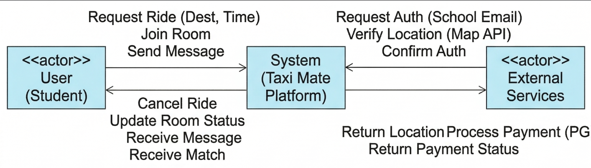

# 1. Conceptualization

**Project Title**: Taxi Mate
  
**Student Info**: 22112052, 문진곤, moonjg0305@yu.ac.kr  
**Repository**: [https://github.com/nogniz/TaxiMate](https://github.com/nogniz/TaxiMate)

## [ Revision history ]

| Revision date | Version # | Description | Author |
| :--- | :--- | :--- | :--- |
| 03/27/2026 | 0.1 | 초기 컨셉 잡기 | 문진곤 |
| 06/11/2026 | 1.0 | 실제 구현 기반으로 전면 업데이트 (이메일 인증, JWT, 자동 매칭, WebSocket, 정산) | 문진곤 |

---

## 1. Business purpose

*  대학가에서 택시는 중요한 이동 수단이지만, 혼자 이용하기에는 비용 부담이 큽니다.  
*  실시간으로 목적지가 맞는 사람을 찾기 어렵고 신원 확인이 불확실하다는 단점이 있습니다.  
*  특히 대학교 주변처럼 특정 시간대에 수요가 몰리는 지역에서는 동승자를 찾는 과정 자체가 스트레스가 되기도 합니다.  
*  본 프로젝트는 사용자가 일일이 동승자를 찾아 헤매는 수고를 덜어주는 것을 목표로 합니다.  
*  사용자가 목적지와 시간대만 입력하면, 시스템이 Haversine 공식으로 목적지 간 직선거리를 계산하여 최적의 동승 방에 자동으로 합류시킵니다.  
*  이를 통해 복잡한 검색 과정 없이도 단 몇 번의 클릭만으로 안전하고 저렴하게 택시를 이용할 수 있는 편의성을 제공하고자 합니다.  
*  학교 이메일 인증 시스템을 도입하여 '누가 탈지 모른다'는 불안감을 해소하고 신뢰할 수 있는 대학생 전용 동승 환경을 구축합니다.  
*  탑승 완료 후에는 총 택시비를 인원수로 나누어 1인당 금액을 자동 계산하는 N빵 정산 기능을 제공합니다.

---

## 2. System context diagram

* **Login / Register**: JWT 기반 로그인 및 학교 이메일 인증을 통한 회원가입
* **Request Ride**: 동승 요청 (방 개설: 제목, 출발지, 목적지, 출발 시간, 최대 인원)
* **Auto Match**: Haversine 공식 기반 목적지 유사도 자동 매칭 및 방 합류
* **Receive Notification**: WebSocket(STOMP)으로 MATCHED / FULL / COMPLETED / CANCELLED / PAYMENT 실시간 알림 수신
* **Update Room Status**: 방 상태 전환 (WAITING → FULL → COMPLETED / CANCELLED)
* **Send/Receive Message**: 동승자 간 실시간 WebSocket 채팅
* **Process Payment**: N빵 정산 (총 금액 입력 → 1인당 금액 계산 → 납부 처리)
* **Request/Confirm Auth**: Google SMTP를 통한 학교 이메일 6자리 인증코드 발송 및 검증

---

## 3. Use case list

| No | Use Case | Actor | Description |
| :--- | :--- | :--- | :--- |
| 1 | Login / Logout | User | 등록된 이메일+비밀번호로 JWT 토큰을 발급받아 시스템에 접속함 |
| 2 | Register | User | 학교 이메일 인증(6자리 코드, 3분 만료)을 완료한 후 학번/이름/비밀번호로 계정을 생성함 |
| 3 | View My Profile | User | JWT 인증 후 본인의 학번, 이름, 이메일, 매너 온도를 조회함 |
| 4 | Update Manner Temperature | User | 동승 완료 후 매너 온도 점수를 갱신함 |
| 5 | Create Room | User | 제목, 출발지, 목적지, 출발 시간, 최대 인원을 설정하여 WAITING 상태의 동승 방을 생성함 |
| 6 | Auto Match | User | 목적지를 입력하면 시스템이 Haversine 거리 계산으로 2km 이내 기존 방에 자동 합류 처리함 |
| 7 | Complete Room | User (Host) | 방장이 탑승 완료 처리 시 방 상태가 WAITING/FULL → COMPLETED로 전환됨 |
| 8 | Cancel Room | User (Host) | 방장이 방 취소 시 WAITING/FULL → CANCELLED로 전환됨 |
| 9 | Send/Receive Message | User | 매칭된 동승자들과 WebSocket 기반 실시간 채팅을 주고받음 |
| 10 | Receive Notification | User | WebSocket(STOMP) 구독을 통해 MATCHED / FULL / COMPLETED / PAYMENT 등의 이벤트를 실시간으로 수신함 |
| 11 | Process Payment | User | COMPLETED 상태 방에서 총 택시비를 입력하면 1인당 금액이 자동 계산되고 개인별 납부 처리를 진행함 |
| 12 | Request / Confirm Auth | Email Server | Google SMTP 서버로 인증코드를 발송하고 3분 내 일치 여부를 검증함 |

---

## 4. Concept of operation

### 1) Login / Register
*  **Purpose**: 학교 이메일 인증을 통해 대학생 신분을 검증하고 JWT 기반 인증 토큰을 발급함.  
*  **Approach**: `POST /api/auth/email`로 인증코드 발송 → `POST /api/auth/verify`로 검증 → `POST /api/users/register`로 등록 → `POST /api/users/login`으로 JWT 발급.  
*  **Dynamics**: 인증코드는 3분 만료이며, 로그인 성공 시 24시간 유효한 JWT가 발급됨.  
*  **Goals**: 허위 계정 방지 및 서비스 안전성 극대화.

### 2) View My Profile & Manner Temperature
*  **Purpose**: 본인의 프로필과 신뢰도 지표(매너 온도)를 확인하고 관리함.  
*  **Approach**: `GET /api/users/me`로 JWT 인증 후 프로필 조회. `PATCH /api/users/manner`로 점수 갱신.  
*  **Dynamics**: 매너 온도는 동승 완료 후 상대방 평가 점수로 갱신됨.  
*  **Goals**: 신뢰할 수 있는 동승 환경 유지.

### 3) Create Room / Auto Match
*  **Purpose**: 새로운 동승 그룹 생성 혹은 경로가 유사한 기존 방에 자동 합류.  
*  **Approach**: `POST /api/rooms`로 방 생성 (WAITING 상태). `POST /api/rooms/match`로 Haversine 공식 기반 자동 매칭.  
*  **Dynamics**: 목적지 간 직선거리 2km 이내이면 기존 방에 자동 합류되며, MATCHED 알림이 WebSocket으로 발송됨. 최대 인원 충족 시 FULL 알림 발송.  
*  **Goals**: 수동 검색 없이 자동으로 최적의 동승 파트너 매칭.

### 4) Room Status Transitions
*  **Purpose**: 동승 방의 수명 주기(개설 → 운행 완료 또는 취소)를 명확하게 관리함.  
*  **Approach**: 방장 전용 엔드포인트(`/complete`, `/cancel`)로 상태 전환. 불법적 전이는 400 오류 반환.  
*  **Dynamics**: WAITING ↔ FULL 자동 전환, COMPLETED/CANCELLED는 Terminal 상태로 되돌릴 수 없음.  
*  **Goals**: 예약 현황 정확성 유지 및 정산 진입 조건 보장.

### 5) Send / Receive Message & Notifications
*  **Purpose**: 매칭된 인원 간 실시간 소통 및 시스템 이벤트의 즉각적 전달.  
*  **Approach**: STOMP over SockJS WebSocket으로 채팅(`/sub/chat/room/{roomId}`)과 알림(`/sub/notification/{roomId}`) 별도 채널 운용.  
*  **Dynamics**: 알림 타입: MATCHED, FULL, COMPLETED, CANCELLED, PAYMENT, PAYMENT_DONE.  
*  **Goals**: 지연 없는 실시간 소통 및 이벤트 전달.

### 6) Process Payment (N빵)
*  **Purpose**: 탑승 완료 후 총 택시비를 인원수로 균등 분배하여 투명한 정산을 제공함.  
*  **Approach**: `POST /api/payments/{roomId}`로 총 금액 입력 → `Math.ceil(totalFare/headCount)`로 1인당 금액 계산 → `PATCH /api/payments/{roomId}/pay`로 개인별 납부 처리 → 전원 납부 완료 시 PAYMENT_DONE 알림 발송.  
*  **Dynamics**: COMPLETED 상태 방에서만 정산 가능. 이중 납부 방지 검증 포함.  
*  **Goals**: 정확하고 투명한 N빵 정산 및 완료 알림.

### 7) Request / Confirm Auth (Email Server)
*  **Purpose**: 외부 이메일 서버를 통한 실제 대학생 여부 최종 확정.  
*  **Approach**: Google SMTP(`smtp.gmail.com:587`, TLS)로 6자리 코드 발송. 3분 내 입력 시 인증 완료.  
*  **Dynamics**: 인증 성공 시에만 회원가입 진행 가능. 코드 만료 시 재발송 필요.  
*  **Goals**: 허위 계정 방지 및 서비스 안전성 극대화.

---

## 5. Problem statement

*  **실시간 데이터 처리**: 여러 사용자의 동승 요청을 실시간으로 처리하기 위해 WebSocket(STOMP) 기반 비동기 알림 시스템을 도입하였다.
*  **신뢰성 및 보안 문제**: 학교 이메일 인증과 JWT Stateless 인증으로 허위 계정과 인증 우회를 방지하였다. BCrypt로 비밀번호를 단방향 해시 저장하여 개인정보 노출을 최소화하였다.
*  **매칭 정확도**: Google Maps API 대신 Haversine 공식을 직접 구현하여 외부 API 의존도 없이 좌표 기반 거리 계산을 수행하였다.
*  **결제 및 정산의 투명성**: 외부 PG사 연동 없이 시스템 내부에서 1인당 금액 계산 및 납부 상태를 추적하여 정산의 정확성을 보장하였다.
* **비기능적 요구사항 (NFRs)**:
    *  **응답성**: WebSocket 알림 및 REST API 응답 시간 100ms 이내 (테스트 완료).
    *  **가용성**: Spring Boot Embedded Tomcat으로 안정적 운영.
    *  **보안**: Spring Security 6.1.5 + JWT + BCrypt 적용.

---

## 6. Glossary

*  **동승 (Carpooling)**: 같은 방향 승객들이 택시를 나누어 타고 비용을 분담하는 행위.  
*  **매너 온도 (Manner Temperature)**: 상호 평가를 통해 시각화한 사용자의 신뢰도 지표. 기본값 36.5도.  
*  **Haversine 공식**: 지구 구면 위 두 위도/경도 좌표 간의 최단 직선거리를 계산하는 공식. 임계값 2km 이내 시 자동 매칭 승인.  
*  **N빵 (Split Fare)**: 총 택시 요금을 탑승 인원 수로 균등 분배하는 정산 방식.  
*  **JWT (JSON Web Token)**: 서버 세션 없이 인증 상태를 유지하는 자가 검증 토큰. 24시간 유효.  
*  **STOMP**: WebSocket 위에서 pub/sub 메시지 라우팅을 담당하는 서브프로토콜.  
*  **WAITING / FULL / COMPLETED / CANCELLED**: TaxiRoom의 상태 값. COMPLETED와 CANCELLED는 Terminal 상태.

---

## 7. References

*  **Spring Boot 3.1.5 Documentation**: https://docs.spring.io/spring-boot/docs/3.1.5/reference/html/
*  **JJWT 0.11.5**: https://github.com/jwtk/jjwt  
*  **Spring WebSocket + STOMP Guide**: https://spring.io/guides/gs/messaging-stomp-websocket/
*  **Haversine Formula**: 지구 구면 거리 계산 공식 적용 참조.
