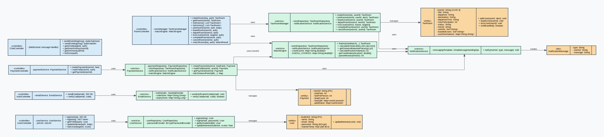
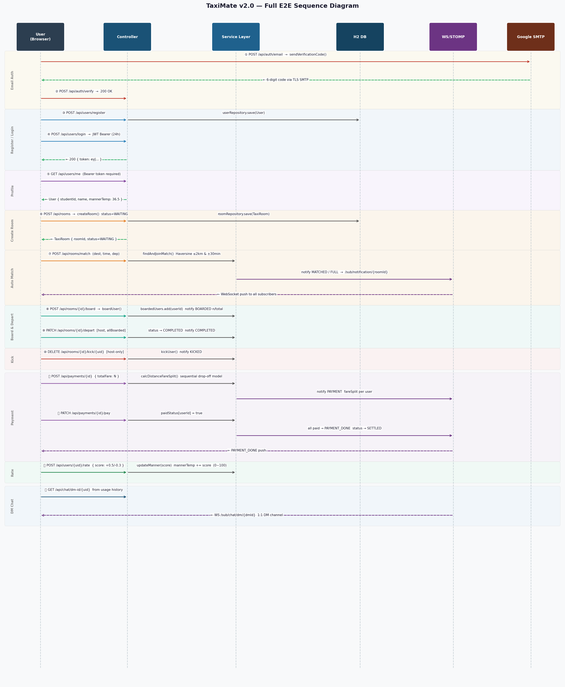
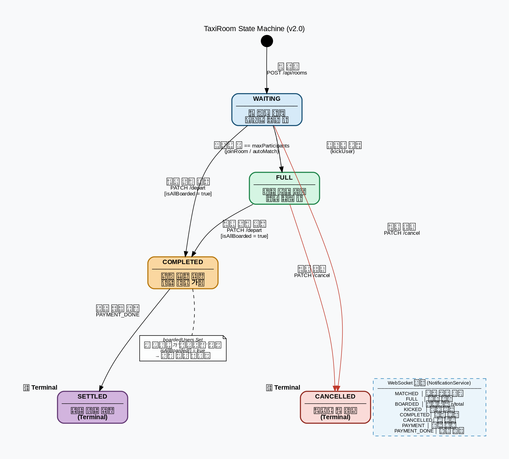

# 3. Detailed Design Specification

**Project Title**: 실시간 위치 기반 대학생 택시 동승 플랫폼 "Taxi Mate"  
**Student Info**: 22112052, 문진곤, moonjg0305@yu.ac.kr  
**Repository**: [https://github.com/nogniz/TaxiMate](https://github.com/nogniz/TaxiMate)

---

## [ Revision history ]

| Revision date | Version # | Description | Author |
| :--- | :--- | :--- | :--- |
| 03/27/2026 | 0.1 | 초기 컨셉 설정 및 기획안 작성 | 문진곤 |
| 04/15/2026 | 0.5 | Use Case 및 Domain Analysis(분석 보고서) 완료 | 문진곤 |
| 06/02/2026 | 1.0 | Sequence / State Machine Diagram 기반 Detailed Design(설계 보고서) 완료 | 문진곤 |
| 06/11/2026 | 2.0 | 실제 구현 기반으로 Class / Sequence / State Machine Diagram 전면 업데이트 | 문진곤 |

---

## = Contents =
1. [Introduction](#1-introduction)
2. [Class diagram](#2-class-diagram)
3. [Sequence diagram](#3-sequence-diagram)
4. [State machine diagram](#4-state-machine-diagram)
5. [Implementation requirements](#5-implementation-requirements)
6. [Glossary](#6-glossary)
7. [References](#7-references)

---

## 1. Introduction

### 1.1 Summary
현대 사회의 대학생들에게 이동 수단은 단순한 이동을 넘어 시간과 비용의 효율성을 결정짓는 중요한 요소이다. 최근 다양한 모빌리티 서비스가 등장했으나, 대학생들이 매일 부담하기에는 택시 비용이 너무 높고, 기존의 카풀 방식은 신원 확인의 불확실성과 실시간 매칭의 어려움으로 인해 직관적인 편리함을 제공하지 못하고 있다. 이에 대학생들이 겪는 경제적 부담을 덜어주고, 안전하면서도 직관적인 동승 환경을 제공하기 위해 기획된 플랫폼이 바로 "Taxi Mate"이다.

본 버전(v2.0)은 Spring Boot 3.1.5 + Java 17 기반으로 실제 구현된 백엔드 서버를 기준으로 작성되었으며, 이메일 인증 → 회원가입 → JWT 인증 → 방 개설 → 자동 매칭 → 상태 전환 → WebSocket 알림 → 정산 N빵까지의 전체 플로우가 구현 및 테스트 완료되었다.

### 1.2 Important Points of Design
* **Spring Boot MVC 아키텍처**: Controller → Service → Repository 3계층 구조로 레이어 간 결합도를 낮추고 유지보수성을 극대화하였다.
* **JWT 기반 Stateless 인증**: Spring Security 6.1.5와 JJWT 0.11.5를 사용하여 세션 없이 토큰 기반 인증을 구현하였다. JwtAuthFilter가 모든 보호 엔드포인트에서 Bearer 토큰을 검증한다.
* **실시간 WebSocket 알림**: STOMP over SockJS 방식으로 WebSocket을 구현하였으며, NotificationService가 `/sub/notification/{roomId}` 토픽으로 MATCHED, FULL, COMPLETED, CANCELLED, PAYMENT, PAYMENT_DONE 이벤트를 푸시한다.
* **Haversine 기반 자동 매칭**: MatchEngine이 두 지점의 위도/경도로 Haversine 공식을 적용해 직선거리를 계산하고, 임계값(기본 2km) 이내이면 자동 합류(MATCHED) 처리한다.
* **방 상태 머신**: TaxiRoom의 상태는 WAITING → FULL → COMPLETED / CANCELLED로 엄격하게 제어되며, 잘못된 전이 시 IllegalStateException을 반환한다.
* **정산 N빵**: PaymentService가 방 참여자 수로 총 택시비를 나누어 1인당 금액을 계산하고, 모든 인원이 납부 처리 완료 시 PAYMENT_DONE 알림을 발송한다.

---

## 2. Class diagram

본 프로젝트는 Spring Boot MVC 패턴을 기반으로 Controller / Service / Repository / Model 4개의 레이어로 구성된다. 실제 구현된 클래스 전체를 반영하였다.

### 2.1 Class Diagram Specifications (Detailed Tables)

#### 1) UserController
* **Description**: 회원가입, 로그인, 프로필 조회, 매너 온도 갱신 엔드포인트를 제공하는 REST 컨트롤러이다.
* **Endpoint**: `/api/users`

| 구분 | Name | Type | Visibility | Description |
| :--- | :--- | :--- | :--- | :--- |
| **Attributes** | userService | UserService | private | 사용자 비즈니스 로직 위임 |
| | jwtUtil | JwtUtil | private | JWT 토큰 생성/검증 |
| **Operations** | register(req) | 200 OK / User | public | 이메일 인증 완료 후 회원가입 처리 |
| | login(req) | 200 OK / JWT | public | 이메일+비밀번호 검증 후 JWT 발급 |
| | getProfile(auth) | 200 OK / User | public | JWT 기반 본인 프로필 반환 |
| | updateManner(auth, body) | 200 OK | public | 매너 온도 점수 갱신 |

#### 2) AuthController
* **Description**: 학교 이메일 인증 코드 발송 및 검증 엔드포인트를 제공한다.
* **Endpoint**: `/api/auth`

| 구분 | Name | Type | Visibility | Description |
| :--- | :--- | :--- | :--- | :--- |
| **Attributes** | emailService | EmailService | private | 이메일 발송 로직 위임 |
| **Operations** | sendEmail(email) | 200 OK | public | 6자리 인증코드를 학교 이메일로 SMTP 발송 |
| | verifyCode(email, code) | 200 OK / 400 | public | 인증코드 일치 여부 및 3분 만료 검증 |

#### 3) RoomController
* **Description**: 동승 방 생성, 단건 조회, 완료/취소 처리 엔드포인트를 제공한다.
* **Endpoint**: `/api/rooms`

| 구분 | Name | Type | Visibility | Description |
| :--- | :--- | :--- | :--- | :--- |
| **Attributes** | roomManager | TaxiRoomManager | private | 방 상태 관리 위임 |
| | matchEngine | MatchEngine | private | 자동 매칭 처리 위임 |
| **Operations** | createRoom(req, auth) | 200 OK / Room | public | 새로운 동승 방 생성 (JWT 필요) |
| | getRoom(roomId) | 200 OK / Room | public | 특정 방의 현재 상태 조회 |
| | completeRoom(roomId, auth) | 200 OK | public | 방 상태를 COMPLETED로 전환 (방장 전용) |
| | cancelRoom(roomId, auth) | 200 OK | public | 방 상태를 CANCELLED로 전환 (방장 전용) |
| | matchRoom(req, auth) | 200 OK / MatchResult | public | 목적지 유사도 기반 자동 매칭 처리 |

#### 4) PaymentController
* **Description**: 정산 시작, 납부 처리, 정산 현황 조회 엔드포인트를 제공한다.
* **Endpoint**: `/api/payments`

| 구분 | Name | Type | Visibility | Description |
| :--- | :--- | :--- | :--- | :--- |
| **Attributes** | paymentService | PaymentService | private | 정산 비즈니스 로직 위임 |
| **Operations** | createPayment(roomId, fare) | 200 OK / Payment | public | COMPLETED 방에서 총 금액으로 N빵 계산 시작 |
| | markPaid(roomId, auth) | 200 OK / Payment | public | JWT 기반 본인 납부 완료 처리 |
| | getPayment(roomId) | 200 OK / Payment | public | 방별 정산 현황 전체 조회 |

#### 5) TaxiRoomManager
* **Description**: TaxiRoom 엔티티의 생성과 상태 전환(COMPLETED / CANCELLED)을 제어하는 서비스 클래스이다.

| 구분 | Name | Type | Visibility | Description |
| :--- | :--- | :--- | :--- | :--- |
| **Attributes** | roomRepository | TaxiRoomRepository | private | JPA 방 저장소 |
| | notificationService | NotificationService | private | 상태 전환 시 WebSocket 알림 발송 |
| **Operations** | createRoom(req, userId) | TaxiRoom | public | roomId(UUID 8자리)를 생성하고 WAITING 상태로 저장 |
| | completeRoom(roomId, userId) | TaxiRoom | public | 방장 검증 후 WAITING/FULL → COMPLETED 전환 |
| | cancelRoom(roomId, userId) | TaxiRoom | public | 방장 검증 후 WAITING/FULL → CANCELLED 전환 |

#### 6) MatchEngine
* **Description**: 입력된 목적지의 위도/경도를 Haversine 공식으로 계산하여 기존 방과의 유사도를 판단하고 자동 합류를 처리하는 서비스 클래스이다.

| 구분 | Name | Type | Visibility | Description |
| :--- | :--- | :--- | :--- | :--- |
| **Attributes** | roomRepository | TaxiRoomRepository | private | 활성 방 목록 조회 |
| | notificationService | NotificationService | private | 매칭 성공/FULL 시 알림 발송 |
| **Operations** | matchRoom(req, auth) | MatchResult | public | WAITING/FULL 방 스캔 후 거리 기반 자동 합류 처리 |
| | haversine(lat1, lon1, lat2, lon2) | double | private | 두 좌표 간 직선거리(km) 계산 |

#### 7) NotificationService
* **Description**: STOMP 메시지 브로커를 통해 지정된 방의 구독 토픽으로 이벤트 알림을 발송하는 서비스 클래스이다.

| 구분 | Name | Type | Visibility | Description |
| :--- | :--- | :--- | :--- | :--- |
| **Attributes** | messagingTemplate | SimpMessageSendingOperations | private | Spring WebSocket 메시지 발송 객체 |
| **Operations** | notify(roomId, type, message) | void | public | `/sub/notification/{roomId}` 토픽으로 NotificationMessage 발송 |

#### 8) EmailService
* **Description**: Google SMTP를 통해 학교 이메일로 6자리 인증코드를 발송하고, 3분 만료 시간과 함께 인증 상태를 메모리에서 관리하는 서비스 클래스이다.

| 구분 | Name | Type | Visibility | Description |
| :--- | :--- | :--- | :--- | :--- |
| **Attributes** | mailSender | JavaMailSender | private | Spring 이메일 발송 객체 |
| | codeStore | Map\<String, String\> | private | 이메일별 발급 인증코드 저장소 |
| | expiryStore | Map\<String, Long\> | private | 인증코드 만료 시각(ms) 저장소 |
| **Operations** | sendVerificationCode(email) | void | public | 6자리 랜덤 코드 생성 후 SMTP 발송 |
| | verifyCode(email, code) | boolean | public | 코드 일치 여부 및 3분 만료 검증 |

#### 9) PaymentService
* **Description**: COMPLETED 상태의 방에서 총 택시비를 인원수로 나누어 1인당 금액을 계산하고, 납부 상태를 추적하는 서비스 클래스이다.

| 구분 | Name | Type | Visibility | Description |
| :--- | :--- | :--- | :--- | :--- |
| **Attributes** | paymentRepository | PaymentRepository | private | JPA 정산 저장소 |
| | roomRepository | TaxiRoomRepository | private | 방 상태 및 참여자 조회 |
| | notificationService | NotificationService | private | 정산 시작 및 완료 시 알림 발송 |
| **Operations** | createPayment(roomId, totalFare) | Payment | public | COMPLETED 방의 참여자 수로 N빵 계산, PAYMENT 알림 발송 |
| | markPaid(roomId, userId) | Payment | public | 본인 납부 처리, 전원 완료 시 PAYMENT_DONE 알림 발송 |
| | getPayment(roomId) | Payment | public | 현재 납부 현황 조회 |

#### 10) Model / Entity Classes

| Class | Table | Key Fields | Description |
| :--- | :--- | :--- | :--- |
| **User** | users | studentId (PK) | 학번, 이름, 이메일, BCrypt 패스워드, 매너온도 |
| **TaxiRoom** | taxi_rooms | roomId (PK, UUID 8자리) | 방 제목, 출발지, 목적지, 출발시간, 최대인원, 상태, 참여자목록, 방장ID |
| **Payment** | payments | roomId (PK) | 총 금액, 1인당 금액, 인원수, 납부상태(Map\<userId, bool\>) |
| **NotificationMessage** | (DTO) | - | 알림 타입, 방ID, 메시지 내용 |

---

## 3. Sequence diagram

### 3.1 Full E2E Flow (STEP 1~13)
사용자가 이메일 인증으로 회원가입 후 로그인하여 동승 방을 개설하고, 자동 매칭 → 탑승 완료 → 정산까지의 전체 상호작용 흐름을 나타낸다.

1. **STEP 1~2 — 이메일 인증**:
    * 사용자가 `POST /api/auth/email`로 학교 이메일을 전송하면, EmailService가 Google SMTP를 통해 6자리 인증코드를 발송한다.
    * `POST /api/auth/verify`로 코드를 검증하며, 3분 초과 시 만료 오류를 반환한다.

2. **STEP 3~4 — 회원가입 & 로그인**:
    * `POST /api/users/register`로 학번, 이름, 이메일, 비밀번호를 등록한다.
    * `POST /api/users/login`으로 성공 시 JJWT로 생성된 24시간 유효 Bearer 토큰이 발급된다.

3. **STEP 5~6 — 프로필 조회 & 매너 온도 갱신**:
    * `GET /api/users/me`로 JWT 인증 후 본인 프로필을 반환한다.
    * `PATCH /api/users/manner`로 매너 온도 점수를 갱신한다.

4. **STEP 7 — 방 개설**:
    * `POST /api/rooms`로 방을 생성하면 UUID 8자리 roomId가 발급되고 상태는 WAITING이 된다.

5. **STEP 8 — 자동 매칭**:
    * `POST /api/rooms/match`로 목적지를 전송하면, MatchEngine이 Haversine 공식으로 기존 방과의 직선거리를 계산한다.
    * 임계값(2km) 이내 방이 존재하면 해당 방에 자동 합류되고, NotificationService가 MATCHED 알림을 WebSocket으로 발송한다.

6. **STEP 9~10 — 상태 전환**:
    * `PATCH /api/rooms/{id}/complete`로 방장이 탑승 완료를 처리하면 상태가 COMPLETED로 전환되고 알림이 발송된다.
    * COMPLETED/CANCELLED 상태의 방에 다시 취소를 시도하면 "이미 종료된 방입니다" 오류를 반환한다.

7. **STEP 11~13 — 정산**:
    * `POST /api/payments/{id}`로 총 택시비를 입력하면 참여자 수로 나눈 1인당 금액이 계산된다.
    * `PATCH /api/payments/{id}/pay`로 본인 납부 처리, `GET /api/payments/{id}`로 현황 조회가 가능하다.

---

## 4. State machine diagram

### 4.1 TaxiRoom State Machine Diagram
TaxiRoom 객체가 생성되어 소멸될 때까지 가질 수 있는 상태와 전이 조건을 정의한다.

| State | Description | 진입 조건 | 가능한 전이 |
| :--- | :--- | :--- | :--- |
| **WAITING** | 방 개설 직후 참여자 대기 중 | 방 생성 시 초기 상태 | → FULL, → COMPLETED, → CANCELLED |
| **FULL** | 최대 인원(maxParticipants) 충족 | 참여자 수 == maxParticipants | → WAITING (인원 감소 시), → COMPLETED, → CANCELLED |
| **COMPLETED** | 탑승 완료 처리됨 | 방장이 `/complete` 호출 | → 정산 가능 상태 (Terminal) |
| **CANCELLED** | 방장이 방 취소 | 방장이 `/cancel` 호출 | → 방 소멸 (Terminal) |

* **전이 제약**: COMPLETED 또는 CANCELLED 상태에서는 더 이상 상태 전이가 불가능하며, 시도 시 400 Bad Request와 오류 메시지를 반환한다.
* **WebSocket 알림**: 모든 상태 전이 시 NotificationService가 해당 roomId의 구독자에게 실시간 이벤트를 발송한다.

---

## 5. Implementation requirements

### 5.1 H/W platform requirements
* **Cloud Server (개발/테스트 환경)**:
    * **Processor**: Intel or AMD 멀티코어 CPU.
    * **Memory**: 4GB RAM 이상 (H2 In-Memory DB 사용으로 최소화).
    * **Storage**: 5GB 이상의 여유 공간 (H2는 파일 저장 불필요).

### 5.2 S/W platform requirements
* **Operating System**: Windows 10/11, macOS, Ubuntu 22.04 LTS 모두 지원.
* **Implementation Language / Environment**:
    * Java 17, Spring Boot 3.1.5
    * Spring Security 6.1.5 (JWT Stateless 인증)
    * Spring WebSocket + STOMP + SockJS (실시간 알림)
    * JJWT 0.11.5 (JSON Web Token)
    * Lombok, Spring Data JPA
* **Database**: H2 In-Memory Database (개발/테스트용, 서버 재시작 시 초기화)
* **Build Tool**: Gradle
* **이메일**: Google SMTP (`smtp.gmail.com:587`, TLS)
* **API 테스트**: IntelliJ HTTP Client (`test.http`, STEP 1~13)

### 5.3 Security Requirements
* 모든 보호 엔드포인트는 `Authorization: Bearer <JWT>` 헤더 필요.
* JWT payload에 studentId(sub), iat, exp(24h) 포함.
* 비밀번호는 BCryptPasswordEncoder로 단방향 해시 저장.
* CORS는 전체 허용(`@CrossOrigin(origins = "*")`), 운영 환경에서는 도메인 제한 필요.

---

## 6. Glossary

| Terms | Description |
| :--- | :--- |
| **JWT (JSON Web Token)** | 서버 세션 없이 인증 상태를 유지하기 위한 자가 검증 토큰. Header.Payload.Signature 구조로 studentId를 sub 클레임에 담아 발급하며, 24시간 유효하다. |
| **STOMP** | Simple Text Oriented Messaging Protocol. WebSocket 위에서 pub/sub 메시지 라우팅을 담당하는 서브프로토콜. TaxiMate에서는 `/sub/notification/{roomId}` 토픽으로 알림을 발송한다. |
| **SockJS** | WebSocket을 지원하지 않는 환경에서 HTTP Long-polling 등의 폴백 전송을 제공하는 JavaScript 라이브러리. |
| **Haversine 공식** | 지구 표면 위 두 위도/경도 좌표 간의 최단 직선거리를 계산하는 공식. MatchEngine이 목적지 유사도 판단에 사용하며, 임계값 2km 이내이면 매칭 성공으로 처리한다. |
| **N빵 (Split Fare)** | 총 택시 요금을 탑승 인원 수로 균등 분배하는 정산 방식. `Math.ceil(totalFare / headCount)`로 1인당 금액을 계산한다. |
| **매너 온도** | 사용자의 서비스 이용 태도와 신뢰도를 시각화한 지표. 기본 36.5도에서 시작하며 동승 완료 후 갱신된다. |
| **WAITING** | 방 개설 직후 참여자를 기다리는 초기 상태. |
| **FULL** | 방의 최대 참여 인원(maxParticipants)이 충족된 상태. |
| **COMPLETED** | 방장이 탑승 완료를 처리한 종료 상태. 이 상태에서만 정산이 가능하다. |
| **CANCELLED** | 방장이 방을 취소한 종료 상태. |
| **H2 In-Memory DB** | 서버 프로세스 메모리 내에서만 동작하는 내장형 관계형 데이터베이스. 서버 재시작 시 모든 데이터가 초기화된다. |
| **BCrypt** | 비밀번호 단방향 해시 알고리즘. Salt가 포함되어 동일 비밀번호도 매번 다른 해시값을 생성한다. |

---

## 7. References

* **Spring Boot Documentation 3.1.5**: https://docs.spring.io/spring-boot/docs/3.1.5/reference/html/
* **Spring Security Reference**: JWT Stateless 인증 및 SecurityFilterChain 설정 참조.
* **JJWT (Java JWT Library) 0.11.5**: https://github.com/jwtk/jjwt
* **Spring WebSocket + STOMP Guide**: https://spring.io/guides/gs/messaging-stomp-websocket/
* **Haversine Formula**: 지구 구면 위 두 좌표 간 거리 계산 공식 적용.
* **H2 Database Engine**: https://www.h2database.com/html/main.html
